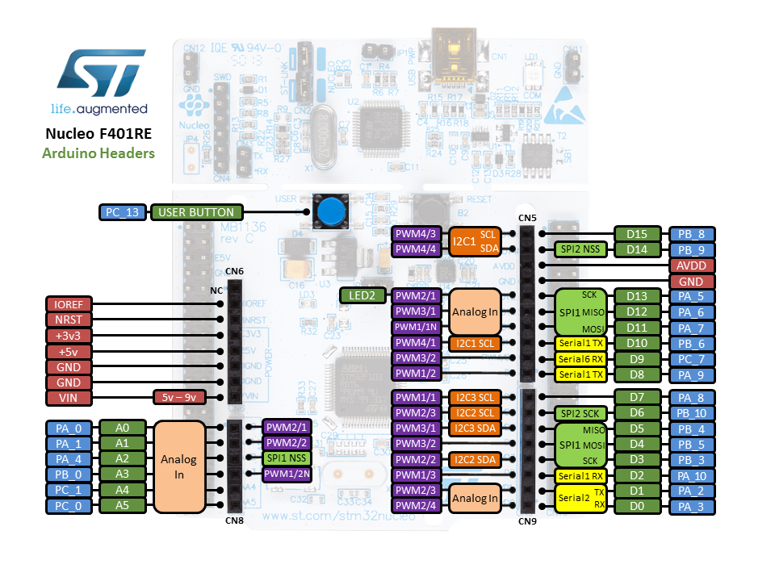
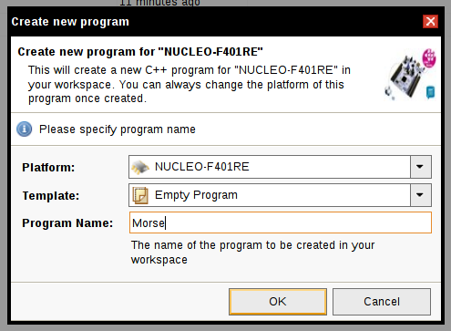

# Mise en oeuvre de la carte STM32 NUCLEO (F401RE)

<details><summary>Sommaire</summary>
<p>

- [Mise en oeuvre de la carte STM32 NUCLEO (F401RE)](#mise-en-oeuvre-de-la-carte-stm32-nucleo-(f401re))
  - [La carte STM32 NUCLEO (F401RE)](#la-carte-stm32-nucleo-(f401re))
  - [La plateforme de développement PlatformIO](#la-plateforme-de-d%C3%A9veloppement-platformio)
  - [La plateforme de développement mbed](#la-plateforme-de-d%C3%A9veloppement-mbed)
    - [Premier programme : led clignotante](#premier-programme-%3A-led-clignotante)
    - [Nouveau programme : SOS (morse)](#nouveau-programme-%3A-sos-(morse))
    - [Communiquer avec le port série](#communiquer-avec-le-port-s%C3%A9rie)
      - [Introduction](#introduction)
      - [Mise en oeuvre](#mise-en-oeuvre)
  - [Glossaire](#glossaire)

</p>
</details>

## La carte STM32 NUCLEO (F401RE)

La carte STM32 [NUCLEO-F401RE](http://www.st.com/content/st_com/en/products/evaluation-tools/product-evaluation-tools/mcu-eval-tools/stm32-mcu-eval-tools/stm32-mcu-nucleo/nucleo-f401re.html) est une carte de développement fabriquée par [STMicroelectronics](https://fr.wikipedia.org/wiki/STMicroelectronics) autour d'un micro-contrôleur ARM Cortex 32 bits [STM32](https://en.wikipedia.org/wiki/STM32). Toutes les cartes Nucleo de STMicroelectronics sont prises en charge par la plateforme de développement [mbed](https://developer.mbed.org/). Elle est commercialisée pour un prix d'environ 10 euros !


Quelques caractéristiques :

* Micro-contrôleur : ARM Cortex 32 bits STM32 84 MHz
* Mémoire flash : 512 KB octets (et 96 KB SRAM)
* 2 types d'extensions disponibles : Arduino Uno V3 et ST Morpho
* ST-LINK/V2-1 (débogage/programmation)
* Alimentation : 3.3V, 5V, 7 - 12V
* Trois Leds : communication USB (LD1), libre pour l'utilisateur (LD2), alimentation (LD3)
* Deux boutons : libre pour l'utilisateur, RESET
* USB : port COM virtuel, stockage de masse (mass storage) et débogage

Et aussi :

* 12-bit ADC with 16 channels
* RTC
* USART/UART (3)
* I2C (3)
* SPI (4)
* ...


La carte Nucleo propose de 2 types d'extensions :

* Arduino Uno V3



* ST Morpho


Site officiel : [www.st.com](http://www.st.com/content/st_com/en/products/evaluation-tools/product-evaluation-tools/mcu-eval-tools/stm32-mcu-eval-tools/stm32-mcu-nucleo/nucleo-f401re.html)

Documentation : [nucleo-f401re.pdf](http://www.st.com/resource/en/data_brief/nucleo-f401re.pdf)

## La plateforme de développement PlatformIO

Liens tutoriels :

- [PlatformIO](http://tvaira.free.fr/dev/tutoriel/platformio.html)
- [PlatformIO CLI](http://tvaira.free.fr/dev/tutoriel/platformio-cli.html)

_Remarque :_ sous GNU/Linux, il est probablement nécessaire de configurer les règles `udev` pour les droits d'accès au périphérique ([99-platformio-udev.rules](https://docs.platformio.org/en/latest//faq.html#platformio-udev-rules)).

### Arduino

La carte STM32 NUCLEO (F401RE) est supportée par [PlatformIO](https://platformio.org/) avec le modèle [STM32F401RE (96k RAM. 512k Flash)](https://docs.platformio.org/en/latest/boards/ststm32/genericSTM32F401RE.html). Différents _frameworks_ sont disponibles dont **Arduino**.

Le fichier `platformio.ini` sera alors :

```ini
; PlatformIO Project Configuration File
; https://docs.platformio.org/en/latest/boards/ststm32/genericSTM32F401RE.html

[env:genericSTM32F401RE]
platform = ststm32
board = genericSTM32F401RE
framework = arduino
upload_protocol = stlink
```

La carte étant branchée sur le port USB ST-LINK, on utilisera le protocole `stlink` et PlatformIO sélectionnera alors OpenOCD :

```
Processing genericSTM32F401RE (platform: ststm32; board: genericSTM32F401RE; framework: arduino)
------------------------------------------------------------------------------------------------
CONFIGURATION: https://docs.platformio.org/page/boards/ststm32/genericSTM32F401RE.html
PLATFORM: ST STM32 (15.1.0) > STM32F401RE (96k RAM. 512k Flash)
HARDWARE: STM32F401RET6 84MHz, 96KB RAM, 512KB Flash
...
Building in release mode
Compiling .pio/build/genericSTM32F401RE/src/main.cpp.o
Linking .pio/build/genericSTM32F401RE/firmware.elf
Checking size .pio/build/genericSTM32F401RE/firmware.elf
Advanced Memory Usage is available via "PlatformIO Home > Project Inspect"
RAM:   [          ]   0.9% (used 856 bytes from 98304 bytes)
Flash: [          ]   2.6% (used 13736 bytes from 524288 bytes)
Configuring upload protocol...
AVAILABLE: blackmagic, dfu, jlink, serial, stlink
CURRENT: upload_protocol = stlink
Uploading .pio/build/genericSTM32F401RE/firmware.elf
xPack OpenOCD x86_64 Open On-Chip Debugger 0.11.0+dev (2021-10-16-21:15)
Licensed under GNU GPL v2
For bug reports, read
        http://openocd.org/doc/doxygen/bugs.html
debug_level: 1

hla_swd
target halted due to debug-request, current mode: Thread 
xPSR: 0x01000000 pc: 0x08000060 msp: 0x20018000
** Programming Started **
** Programming Finished **
** Verify Started **
** Verified OK **
** Resetting Target **
shutdown command invoked
==== [SUCCESS] Took 2.64 seconds ===
```

Le programme peut aussi être fabriqué en ligne de commande (CLI) à partir du terminal :

```sh
$ pio run -v
Processing genericSTM32F401RE (platform: ststm32; board: genericSTM32F401RE; framework: arduino; upload_protocol: stlink; monitor_speed: 115200)
...
$ arm-none-eabi-objcopy -O binary .pio/build/genericSTM32F401RE/firmware.elf .pio/build/genericSTM32F401RE/firmware.bin
```

On obtient alors :

```sh
$ file .pio/build/genericSTM32F401RE/firmware.elf 
.pio/build/genericSTM32F401RE/firmware.elf: ELF 32-bit LSB executable, ARM, EABI5 version 1 (SYSV), statically linked, not stripped

$ ls -hl .pio/build/genericSTM32F401RE/firmware.bin
-rwxrwxr-x 1 tv tv 14K déc.   6 10:00 .pio/build/genericSTM32F401RE/firmware.bin
```

Le _firmware_ obtenu peut être directement copié dans le dossier `NUCLEO` (l’espace flash est monté comme une clé USB) :

```sh
$ ls -l /media/$USERNAME/NUCLEO/
$ cp .pio/build/genericSTM32F401RE/firmware.bin /media/$USERNAME/NUCLEO/
```

Exemple mettant en oeuvre la LED et le bouton embarqués sur la carte STM32 NUCLEO :

- LED verte LD2 : connecteur ARDUINO (signal D13) ->  PA5 (broche 21) des E/S du microcontrôleur STM32
- Bouton B1 : PC13 (broche 2) des E/S du microcontrôleur STM32

```cpp
#include <Arduino.h>

#define TEMPO 300

uint32_t tempo = TEMPO;
uint32_t choix = 1;

void setup()
{
  Serial.begin(115200);
  pinMode(PA5, OUTPUT);
  pinMode(PC13, INPUT);
  Serial.println("NUCLEO Ok");
}

void loop()
{
  digitalWrite(PA5, HIGH);
  delay(tempo);
  digitalWrite(PA5, LOW);
  delay(tempo);
  int etatEntree = digitalRead(PC13);
  if(etatEntree == 0)
  {
    choix = (++choix % 3) + 1;
    tempo = choix * TEMPO;
    Serial.println(tempo);
  }
}
```

### Mbed

Dans PlatformIO, il existe aussi la carte [ST Nucleo F401RE](https://docs.platformio.org/en/latest/boards/ststm32/nucleo_f401re.html) qui supporte en plus le _framework_ [Mbed](https://docs.platformio.org/en/latest/frameworks/mbed.html#framework-mbed).

Le fichier `platformio.ini` sera alors :

```ini
; PlatformIO Project Configuration File
; https://docs.platformio.org/en/latest/boards/ststm32/genericSTM32F401RE.html

[env:nucleo_f401re]
platform = ststm32
board = nucleo_f401re
framework = mbed
upload_protocol = stlink
monitor_speed = 9600
```

Exemples avec `mbed` :

- Clignotement de la LED

```cpp
#include "mbed.h"

DigitalOut myled(LED1);

int main()
{
    while(1)
    {
      myled = !myled;
      ThisThread::sleep_for(1s);
      /*
      myled = 1;
      ThisThread::sleep_for(1s);
      myled = 0;
      ThisThread::sleep_for(1s);
      */
    }
}
```

- Avec le bouton

```cpp
#include "mbed.h"

DigitalIn mybutton(USER_BUTTON);
DigitalOut myled(LED1);

int main()
{
    while(1)
    {
      if(mybutton == 0)
      {
        myled = !myled;
        printf("Appui bouton - Led %d\n", myled.read());
        ThisThread::sleep_for(200ms); // 200 ms
      }
    }
}
```

- Interruption sur le bouton

```cpp
#include "mbed.h"

InterruptIn mybutton(USER_BUTTON);
DigitalOut myled(LED1);

typedef std::chrono::duration<int,std::milli> millisecondes;
//std::chrono::duration<uint32_t, std::milli> tempo(200);
millisecondes tempo(200);

void pressed()
{
  if(tempo == std::chrono::milliseconds(200))
  {
    tempo = std::chrono::milliseconds(1000); // 1 sec
  }
  else
  {
    tempo = std::chrono::milliseconds(200); // 200 ms
  }
}

int main()
{
    mybutton.fall(&pressed);

    while (1)
    {
      myled = !myled;
      ThisThread::sleep_for(tempo);
    }
}
```

- `Timer`, `Timeout` et `Ticker`

```cpp
#include "mbed.h"

using namespace std::chrono;

InterruptIn mybutton(USER_BUTTON);
DigitalOut myled(LED1);

Timer timer;
Timeout timeout;
Ticker ticker;

std::chrono::microseconds t(3000000);

typedef std::chrono::duration<int,std::milli> millisecondes;
//std::chrono::duration<uint32_t, std::milli> tempo(200);
millisecondes tempo(200);

// Pour Ticker
void periode()
{
  tempo = std::chrono::milliseconds(500);
}

// Pour Timeout
void change()
{
  tempo = std::chrono::milliseconds(1000); // 1 sec
}

// Bouton
void pressed()
{
  if(tempo == std::chrono::milliseconds(200))
  {
    tempo = std::chrono::milliseconds(1000); // 1 sec
  }
  else
  {
    tempo = std::chrono::milliseconds(200); // 200 ms
  }
}

int main()
{
    mybutton.fall(&pressed);
    timeout.attach(&change, 3s); // au bout de 3s, passe en clignotement lent
    ticker.attach(&periode, 5s); // toutes les 5s, cf. detach()

    timer.start();
    ThisThread::sleep_for(100ms);
    timer.stop();
    printf("timer = %llu secondes\n", duration_cast<seconds>(timer.elapsed_time()).count());
    printf("timer = %llu millisecondes\n", duration_cast<milliseconds>(timer.elapsed_time()).count());
    //printf("timer = %d millisecondes\n\r", timer.read_ms()); // obsolete
    printf("timer = %llu microsecondes\n", duration_cast<microseconds>(timer.elapsed_time()).count());
    //printf("timer = %d microsecondes\n\r", timer.read_us()); // obsolete

    timer.start();
    ThisThread::sleep_for(50ms);
    timer.stop();
    printf("timer = %llu millisecondes\n", duration_cast<milliseconds>(timer.elapsed_time()).count());

    timer.reset();
    timer.start();
    ThisThread::sleep_for(100ms);
    timer.stop();
    printf("timer = %llu millisecondes\n", duration_cast<milliseconds>(timer.elapsed_time()).count());

    while (1)
    {
      myled = !myled;
      ThisThread::sleep_for(tempo);
    }
}
```

## La plateforme de développement mbed

[mbed](https://developer.mbed.org/) est un IDE (_Integrated Development Environment_) ou EDI (Environnement de Développement Intégré) en ligne. Il nécessite donc une connexion Internet et un navigateur web.

Site : [https://developer.mbed.org/](https://developer.mbed.org/)


Rapide tour d'horizon :

* __Hardware__ : __Boards__ (liste toutes les cartes compatibles) et __Components__ (base de données des composants existants par catégorie)
* __Documentation__ (évidemment la doc sur l'API) et __Cookbook__ (livre de recettes)
* __Code__ (partage de code par la communauté)
* __Questions__ (FAQ) et __Forum__
* __Log In/Signup__
* __Compiler__ (espace de travail de développement)

La première étape pour pouvoir utiliser __mbed__ consiste à __s'enregistrer (Log In/Signup)__.

Pour développer avec la carte Nucleo, il y a 2 façons de procéder :

* Cliquez sur __Hardware__ puis __Boards__. Sélectionnez __STMicroelectronics__ puis sur __NUCLEO-F401RE__. Pour finir cliquez sur __Add to your mbed Compiler__ :


* Ou branchez votre carte sur un port USB. Aller dans le dossier __NUCLEO__ (comme une clef USB) et ouvrir le fichier `mbed.htm` dans un navigateur.


### Premier programme : led clignotante

__Objectifs :__

* prendre en main l'environnement mbed
* créer et compiler un programme
* déployer et tester le programme

_Étapes par étapes :_

Créer une nouvelle application en cliquant sur __New__ puis choisir comme modèle (_template_) __"Blinky LED ..."__ et donner un nom à votre projet :


Vous pouvez modifier le code dans l'éditeur :


Pour tester, il suffit de __compiler__ ... d'__enregistrer le binaire fourni__ (extension `.bin`) et de le __copier dans le dossier NUCLEO__.

_Bonus :_ Essayez maintenant de créer un programme pour tester le bouton USER (bleu sur la carte) à partir du modèle "Read the board user button state".

### Nouveau programme : SOS (morse)

__Objectifs :__

* créer un programme vierge
* importer et exploiter des bibliothèques

_Étapes par étapes :_

Créer une nouvelle application en cliquant sur __New__ puis choisir comme modèle (_template_) __"Empty Program"__ et donner un nom à votre projet :



Ajouter un nouveau fichier avec __New File__ :


Puis éditez le programme suivant :

```cpp
#include "mbed.h"

int main()
{
    while(1)
    {

    }
}
```

On obtient une erreur à la compilation (ce qui est normal car la bibliothèque __mbed__ n'a pas été intégrée au projet et donc le fichier `mbed.h` est introuvable) :


On peut la corriger en cliquant sur "Fix it!" ce qui va nous permettre d'importer la bibliothèque __mbed__ :


Maintenant, on peut compiler avec succès.


On va maintenant importer une nouvelle bibliothèque à notre projet en cliquant sur __Import__, puis on recherche "morse" :


On séléctionne la bibliothèque `MorseGenerator`, on clique sur __Import!__ et on importe :


La classe `MorseGenerator` a été ajoutée au projet et on peut accéder directement à sa documentation :


En utilisant la documentation (on peut utiliser le copier/coller), on édite le programme suivant :

```cpp
#include "mbed.h"
#include "morsegenerator.h"

DigitalOut myled(LED1);

void morsecallback(int val)
{
    myled = val;
}

int main()
{
    MorseGenerator morse = MorseGenerator(morsecallback);

    while(1)
    {
        morse.transmit("SOS BTS SN");

        wait(5);
    }
}
```

On compile et on teste sur la carte !

### Communiquer avec le port série

La __transmission série__ est un mode de transmission de données dans lequel les éléments d'information se succèdent les uns après les autres sur une seule voie entre deux points. Elle s'oppose à la transmission parallèle, qui transmet simultanément les éléments d'information sur plusieurs voies.

La transmission série domine dès que les composants ou périphériques à relier sont à quelque distance. L'ensemble des télécommunications s'établit sur des liaisons série.

La transmission série est très présente dans le monde industriel :

 * pour relier des capteurs/actionneurs (_sensor bus_) ou des composants de bas niveau, on utilise des technologies comme le bus [TWI/I2C](https://fr.wikipedia.org/wiki/I2C), [1-Wire](https://fr.wikipedia.org/wiki/1-Wire), [AS-i](https://fr.wikipedia.org/wiki/Bus_ASi), ...

 * pour relier des périphériques (appareils divers, système de commande, ...), on utilise des bus de terrain (_field bus_) comme le [bus CAN](https://fr.wikipedia.org/wiki/Controller_Area_Network), [DMX](https://fr.wikipedia.org/wiki/DMX_(%C3%A9clairage)), les liaisons [RS232](https://fr.wikipedia.org/wiki/RS-232) ou [RS485](https://fr.wikipedia.org/wiki/EIA-485), ...

La transmission série se fait généralement par trames et nécessite la mise en oeuvre de protocole.

_Remarque :_ Communiquer consiste à transmettre des informations, mais tant que les interlocuteurs ne lui ont pas attribué un sens, il ne s'agit que de données et pas d'information. Les interlocuteurs doivent donc non seulement parler un langage commun mais aussi maîtriser des règles minimales d'émission et de réception des données. C'est le rôle d'un protocole de s'assurer de tout cela.

La carte Nucleo dispose de 3 ports série UART (_Universal Asynchronous Receiver Transmitter_) : Serial1, Serial2 et Serial 6. Le port Serial2 est déjà utilisé par ST-LINK. On va donc utiliser le port Serial1 :

* Serial1 RX : broche D2 (Arduino Headers)
* Serial1 TX : broche D8 ou D10 (Arduino Headers)

On va utiliser un adaptateur USB/RS232 (TTL) pour relier la carte Nucleo et le PC. La prise USB contient un convertisseur USB <-> Série (pl2303) avec un cable terminé par 4 fils :

* Rouge : Alimentation (+5V) fourni par le port USB (non utilisé)
* Noir : Masse (GND)
* Blanc : TX
* Green : RX


On va donc réaliser le cablage suivant :


Côté PC, on utilisera un émulateur de terminal comme cutecomm ou minicom sous GNU/Linux ou HyperTerminal ou Teraterm sous Windows.


Pour accèder au port série, on utilise la classe `Serial` à laquelle on précise en paramètre les broches utilisées pour les lignes __TX__ et __RX__ :

```cpp
Serial port(D10, D2);
```

Il est possible de paramètrer le port série :

```cpp
port.baud(9600);
port.format(8, SerialBase::None, 1);
```

Pour émettre des données, il existe plusieurs méthodes : `putc()`, `puts()`, `printf()`, `write()`.

```cpp
port.printf("Hello wordl!\n");
```

Pour recevoir des données, il existe aussi plusieurs méthodes : `getc()`, `read()`. On vérifiera préalablement la présence d'octets à lire avec `readable()`.

```cpp
if(port.readable())
{
    char c;
    c = port.getc();
    switch(c)
    {
        // ...
        default :
            port.printf("%c\n", c); // echo
        break;
    }
}
```


Le programme :

```cpp
#include "mbed.h"

DigitalIn mybutton(USER_BUTTON);
DigitalOut myled(LED1);
Serial myport(D10,D2);

int main()
{
  myport.baud(9600);
  myport.format(8, SerialBase::None, 1);

  while(1)
  {
    if(mybutton == 0)
    {
      myport.printf("Appui bouton - Led %d\n", myled.read());
      wait(0.2); // 200 ms
    }
    if(myport.readable())
    {
        char c;
        c = myport.getc();
        switch(c)
        {
            case 'A' :
            case 'a' :
                myled = 1;
                break;
            case 'E' :
            case 'e' :
                myled = 0;
                break;
            default :
                myport.printf("%c\n", c); // echo
            break;
        }
    }
  }
}
```

_Remarque :_ il est possible d'exporter le projet ou tout simplement un fichier (`main.cpp` par exemple) en cliquant avec le bouton droit :


## Glossaire

MCU
 :  MCU (_MicroController Unit_) est un microcontrôleur (µc ou uc). C'est un circuit intégré qui rassemble les éléments essentiels d'un ordinateur : processeur, mémoires (mémoire morte pour le programme, mémoire vive pour les données), unités périphériques et interfaces d'entrées-sorties. Les microcontrôleurs se caractérisent par un plus haut degré d'intégration, une plus faible consommation électrique, une vitesse de fonctionnement plus faible et un coût réduit par rapport aux microprocesseurs polyvalents utilisés dans les ordinateurs personnels. Les microcontrôleurs sont fréquemment utilisés dans les systèmes embarqués. Lire : [https://fr.wikipedia.org/wiki/Microcontr%C3%B4leur](https://fr.wikipedia.org/wiki/Microcontr%C3%B4leur).

Système embarqué
 :  Un système embarqué est défini comme un système électronique et informatique autonome, souvent temps réel, spécialisé dans une tâche bien précise. Le terme désigne aussi bien le matériel informatique que le logiciel utilisé. Ses ressources sont généralement limitées. Cette limitation est généralement d'ordre spatial (encombrement réduit) et énergétique (consommation restreinte).

ARM
 :  ARM est une société britannique spécialisée dans le développement d'architectures 32 bits de type RISC. Fondée sous la forme d'une coentreprise par Acorn Computers, Apple Computer (maintenant Apple Inc.) et VLSI Technology, ARM développe également un grand nombre de blocs de propriété intellectuelle (IP). Elle est basée sur un modèle économique particulier de la microélectronique : la conception de propriétés intellectuelles (Intellectual Properties). Ainsi il n'est pas possible d'acheter un processeur ARM comme c'est le cas pour Intel. Les cœurs ARM sont intégrés au sein de systèmes sur puces (SoC) complets. Les cœurs de processeurs ARM sont très présents dans les systèmes embarqués (téléphone mobile, console portable, tablette électronique).

Architecture ARM
 :  Les architectures ARM sont des architectures matérielles RISC 32 bits (ARMv1 à ARMv7) et 64 bits (ARMv8)1 développées par ARM Ltd depuis 1990 et introduites à partir de 1983 par Acorn Computers. Dotés d'une architecture relativement plus simple que d'autres familles de processeurs, et bénéficiant d'une faible consommation, les processeurs ARM sont devenus dominants dans le domaine de l'informatique embarquée, en particulier la téléphonie mobile et les tablettes. Ces processeurs sont fabriqués sous licence par un grand nombre de constructeurs.

Mémoire Flash
 :  La mémoire flash est une mémoire de masse à semi-conducteurs ré-inscriptible, c'est-à-dire une mémoire possédant les caractéristiques d'une mémoire vive mais dont les données ne disparaissent pas lors d'une mise hors tension. Ainsi, la mémoire flash stocke les bits de données dans des cellules de mémoire, mais les données sont conservées en mémoire lorsque l'alimentation électrique est coupée. La technique flash se décline sous deux principales formes : flash NOR et NAND, selon le type de porte logique utilisée pour chaque cellule de stockage. Sa durée de vie est limitée par le nombre de cycles d'écriture.

EDI
 :  Un EDI (ou IDE pour Integrated Development Environment) est un environnement de développement pouvant contenir de nombreux outils comme : un éditeur de texte, une chaîne de compilation, la documentation en ligne, la gestion de version et un débogueur (debugger) qui permet de trouver des erreurs et de les éliminer. Il existe de nombreux EDI (ou IDE) pour le langage C/C++ : Visual C++, Builder, Qt Creator, Code::Blocks, devcpp, eclipse, etc... Ils peuvent être très pratique en améliorant surtout la productivité dans un cadre professionnel.

Morse
 :  L'alphabet morse ou code morse, est un code (inventé en 1832) permettant de transmettre un texte à l'aide de séries d'impulsions courtes et longues, qu'elles soient produites par des signes, une lumière, un son ou un geste. Le code morse est considéré comme le précurseur des communications numériques.

Terminal
 :  Un terminal est le nom d'un logiciel d'émulation de terminal. Un émulateur de terminal, aussi appelé console virtuelle ou terminal virtuel, est un logiciel qui émule le fonctionnement d'un terminal informatique ce qui permet d'interagir avec les commandes Unix lorsqu'on utilise un environnement graphique.

UART
 :  UART (_Universal Asynchronous Receiver Transmitter_) est le composant utilisé pour faire la liaison entre l'ordinateur et le port série. L'ordinateur envoie les données en parallèle (autant de fils que de bits de données). Il faut donc transformer ces données pour les faire passer à travers une liaison série qui utilise un seul fil pour faire passer tous les bits de données.

Trame UART
 :  Une trame UART est constituée des bits suivants : un bit de start toujours à 0 (servant à la synchronisation du récepteur), les données (la taille peut varier généralement entre 5 et 9 bits), éventuellement un bit de parité paire ou impaire et un bit de stop toujours à 1 (la durée peut varier entre 1, 1,5 et 2 temps bit). Les vitesses de transmission sont normalisées par multiples et sous-multiples de 9600 bauds, l'unité baud correspondant à un bit par seconde.


RS232
 :  RS-232 (ou RS-232) est une norme standardisant une voie de communication de type série. Disponible sur presque tous les PC depuis 1981 jusqu'au milieu des années 2000, il est communément appelé le « port série ». Sur les systèmes d'exploitation MS-DOS et Windows, les ports RS-232 sont désignés par les noms COM1, COM2, etc. Cela leur a valu le surnom de « ports COM », encore utilisé de nos jours. Les liaisons RS-232 sont fréquemment utilisées dans l'industrie pour connecter différents appareils électroniques (automate, appareil de mesure, etc.).

RS485
 :  RS485 (ou RS-485) est une norme qui définit les caractéristiques électriques de la couche physique d'une interface numérique sérielle utilisée dans de nombreux réseaux industriels (Modbus, Profibus, ...). Ses caractéristiques essentielles sont : liaison multi-point permettant d'interconnecter plusieurs dispositifs (jusqu'à 32 émetteurs et 32 récepteurs), bus informatique cablé avec 2 fils (en _half duplex_) ou 4 fils (_full duplex_), distance maximale de l'ordre du kilomètre en mode différentiel (qui permet d'obtenir une meilleur tolérance aux perturbations) et débit élévé jusqu'à 10Mbits/s.

Parité
 :  Le bit de PARITÉ (facultatif) est un bit généré lors de l'émission et testé lors de la réception pour détecter une erreur de transmission. La parité est paire (_even_) lorsque le nombre de bits (donnée + parité) est pair. La parité est impaire (_odd_) lorsque le nombre de bits (donnée + parité) est impair.

Simplex
 :  L'exploitation de la ligne se fait en mode unidirectionnel.

Half Duplex
 :  La transmission est possible dans les deux sens mais pas simultanément.

Full Duplex
 :  L'exploitation de la ligne se fait en mode bidirectionnel simultané sur le même support physique.
